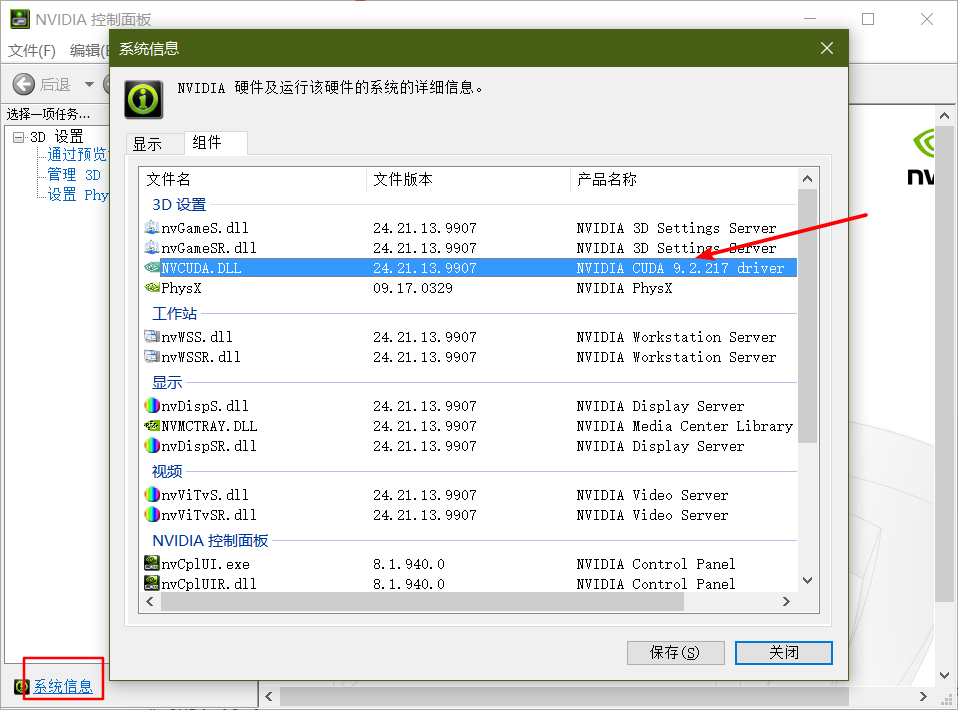
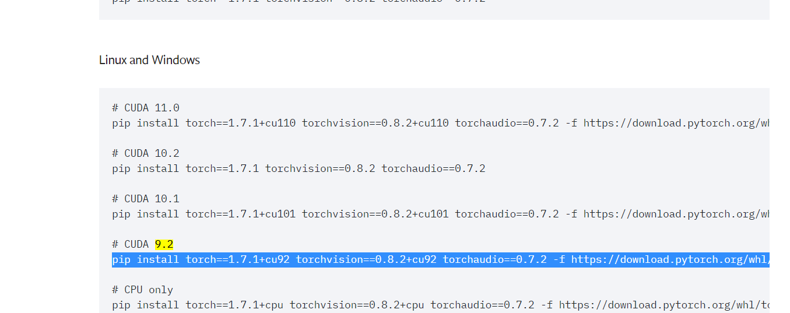

教学视频: https://www.bilibili.com/video/BV1ma4y1g791/?vd_source=a2f6ab85bc9c65007fe55aa705019af5

github: https://github.com/zyds/transformers-code


# 01-Getting Started

## conda

### 下载conda并安装

清华镜像源

https://mirrors.tuna.tsinghua.edu.cn/anaconda/miniconda/

下载这个进行安装

安装路径不要有中文

[Miniconda3-py39_22.11.1-1-Windows-x86_64.exe](https://mirrors.tuna.tsinghua.edu.cn/anaconda/miniconda/Miniconda3-py39_22.11.1-1-Windows-x86_64.exe)

配置conda路径到环境变量 PATH

配置conda路径\Scripts 到环境变量 PATH

这样连python, pip一起安装了


### 初始化

```shell
conda create -n transformers python=3.9

# 激活环境
conda init
conda activate transformers
conda deactivate
```

看到命令行前面出现(transformers), 表示激活成功了

### 设置国内镜像源

清华镜像源首页

https://mirrors.tuna.tsinghua.edu.cn/help/pypi/

设置默认镜像源为清华镜像源

```
pip config set global.index-url https://pypi.tuna.tsinghua.edu.cn/simple
```


### 安装cuda

查看系统显卡信息

桌面 -> 右键 -> NVIDIA控制面板 -> 左下角 系统信息

显卡最高支持cuda 9.2



到pytorch官网

https://pytorch.org/

找到历史版本

找到支持cuda 9.2的



```
pip install torch==1.7.1+cu92 torchvision==0.8.2+cu92 torchaudio==0.7.2 -f https://download.pytorch.org/whl/torch_stable.html
```

