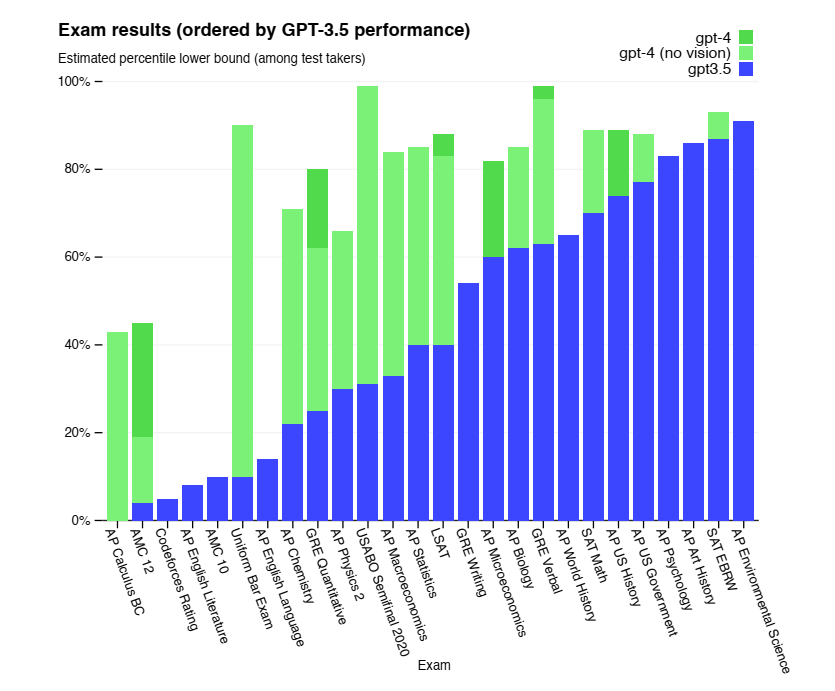
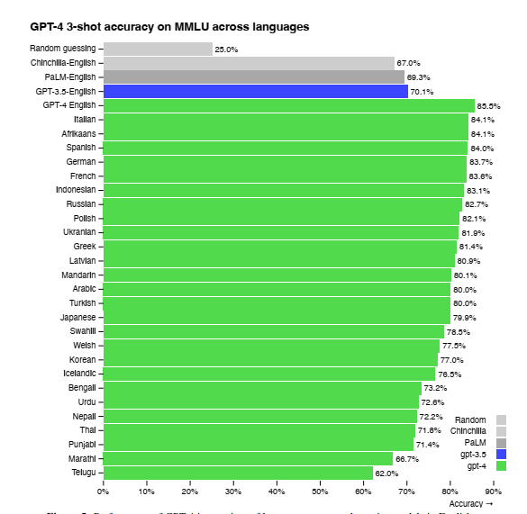
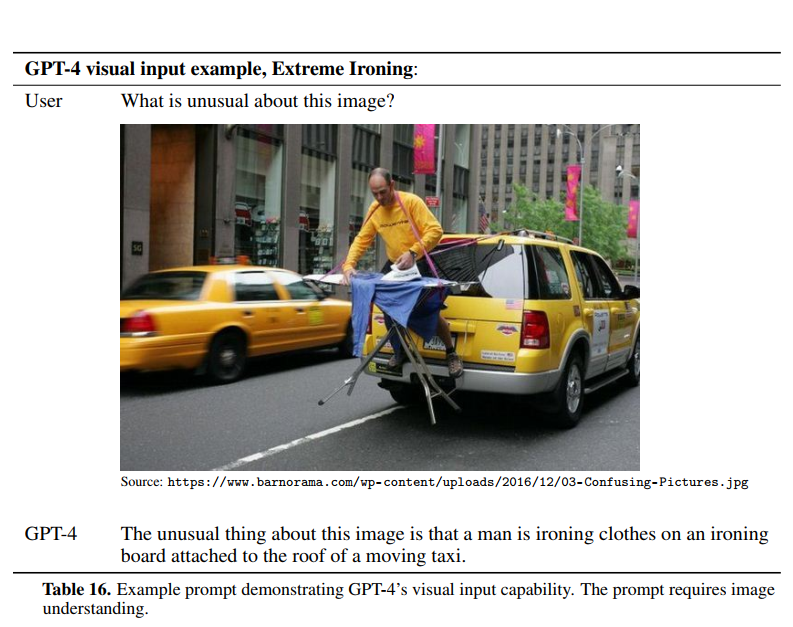
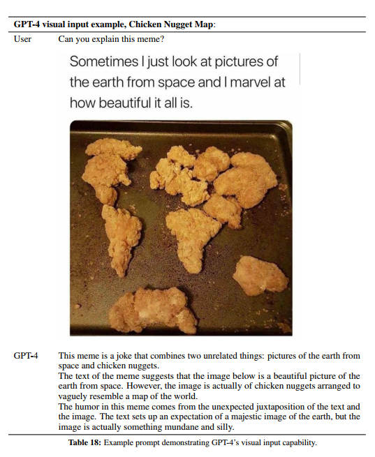

# 大语言模型调研任务

调研排前10的base模型
（huggingface、魔塔社区或者公众号等）
https://huggingface.co/spaces/HuggingFaceH4/open_llm_leaderboard

论文地址：

git地址:

论文简介:

模型地址：

所用数据集:

算法结构：

训练方法:

评估报告（多个benchmark）：

效果展示:

谷歌翻译软件

https://immersivetranslate.com/en/

# 相关链接

建议收藏！大模型100篇必读论文

https://zhuanlan.zhihu.com/p/687036486

介绍了100篇论文

系统学习大模型的20篇论文

https://cloud.tencent.com/developer/article/2322224

介绍了几篇大模型的入门论文

对应的英文文章 https://magazine.sebastianraschka.com/p/understanding-large-language-models

# 模型介绍

目前流行的base模型主要包括以下几种：

1. **GPT-4-Turbo**：由OpenAI开发的GPT-4-Turbo在多项评测中表现突出，被认为是目前最强大的大型语言模型之一。它在知识、语言、理解、推理和考试等能力维度上均有优秀表现。
2. **智谱清言GLM-4**：智谱（Baidu）开发的清言GLM-4是国内领先的大型语言模型之一，它在语言和知识等基础能力维度上可比肩GPT-4 Turbo。
3. **阿里巴巴Qwen-Max**：阿里巴巴推出的Qwen-Max在大模型评测中紧随GPT-4-Turbo之后，展现了较强的综合性能。
4. **百度文心一言4.0**：百度的文心一言4.0也是国内表现优秀的大型语言模型，尤其在中文场景下展现出优势。
5. **Yi-34B-Chat** 和 **InternLM2-Chat-20B**：这两个开源模型在综合性对话体验上表现突出，提供了良好的基础用于学术研究和工业应用。
6. **Moonshot**：由月之暗面科技有限公司开发的Moonshot模型在综合能力上超过GPT3.5，展现了长足的进步。
7. **vivo的BlueLM** 和 **腾讯的混元**：这两个模型也在中文大模型基准测评中表现良好，显示了国内大模型的快速发展。
8. **清华&智谱AI的ChatGLM3**
9. **字节跳动的云雀**

这些模型在不同的评测维度上各有优势，但普遍面临的挑战是复杂推理相关能力的提升。在选择使用这些模型时，需要根据具体的应用场景和需求来决定最适合的模型。

# GPT-4-turbo

模型: GPT-4-turbo

论文: GPT-4 Technical Report

论文地址: https://arxiv.org/abs/2303.08774

git地址:

论文简介:

该报告由OpenAI发布。GPT-4是一个大型多模态模型，能够接受图像和文本输入并产生文本输出。报告详细介绍了GPT-4的开发背景、能力、局限性以及安全性挑战。

模型地址：
所用数据集: 

1.  **MMLU (Massive Multitask Language Understanding)**: 这是一个包含57个主题的多选题基准测试，用于评估模型在多个领域的理解能力。
1.  **GSM-8K**: 这是一个数学问题解答的数据集，用于提高模型的数学推理能力。
1.  **HellaSwag**: 这是一个常识推理的数据集，用于评估模型的常识和推理能力。
1.  **AI2 Reasoning Challenge (ARC)**: 这个数据集包含了一系列的科学问题，用于测试模型的科学推理和理解能力。
1.  **WinoGrande**: 这是一个用于评估模型在复杂环境中的推理和生成能力的数据集。
1.  **HumanEval**: 这个数据集用于评估模型生成的文本与人类生成文本的相似性。
1.  **DROP**: 这是一个阅读理解数据集，用于评估模型的阅读理解能力。
1.  **GRE, SAT, AP等考试数据**: 这些标准化考试的数据被用来评估GPT-4在学术和专业考试中的表现。

算法结构：
训练方法:
评估报告（多个benchmark）：

GPT-4的技术报告中提供了对模型效果的全面评估，包括多种专业和学术考试的模拟、传统NLP基准测试以及多模态理解任务。以下是一些关键点：

1. **学术和专业考试**:
   - GPT-4在多种学术和专业考试中表现出人水平的性能，包括但不限于LSAT（法学院入学考试）、SAT（美国大学入学考试）、GRE（研究生入学考试）、AP（大学预修课程）等。
   
- 例如，在模拟的统一律师考试（Uniform Bar Exam）中，GPT-4的得分位于前10%的考生之中。
  
  ​     

2. **传统NLP基准测试**:
   - 在多个传统的NLP基准测试中，GPT-4的性能超越了以往的大型语言模型和大多数最先进的系统。
   - 例如，在MMLU基准测试中，GPT-4不仅在英语中表现优异，而且在翻译成26种语言的版本中，有24种语言的性能超过了英语版本的最先进水平。

   
   
3. **多模态理解**:

   - GPT-4展示了处理包含图像和文本输入的能力，这在诸如解释图像内容和回答相关问题的任务中得到了体现。

4. **安全性和对齐**:

   - 报告中提到了对GPT-4安全性的评估，包括对抗性测试和红队测试，以及通过模型辅助的安全管道来提高模型的安全性。

5. **链式推理**:

   - GPT-4在需要链式推理的任务上表现出色，这表明模型能够进行深层次的逻辑和推理过程。

6. **用户意图遵循**:

   - 通过与ChatGPT和OpenAI API的用户交互数据，GPT-4在遵循用户意图方面的表现优于GPT-3.5。

7. **限制和挑战**:

   - 尽管GPT-4在多项任务上表现出色，报告也指出了模型的局限性，包括有时会产生不准确或虚假的信息，以及在处理一些高级任务时的挑战。

报告中的这些评估结果是基于模型在特定时间点的性能，而且OpenAI在发布模型时通常会提供一些访问方式，让研究人员和开发者可以进一步测试和评估模型。需要注意的是，这些评估结果可能会随着模型的更新和改进而变化。

效果展示: 

# Neural Machine Translation by Jointly Learning to Align and Translate\* (2014) by Bahdanau, Cho, and Bengio

论文地址：https://arxiv.org/abs/1409.0473
git地址:
论文简介:

一篇关于神经机器翻译的学术论文，标题为"Neural Machine Translation by Jointly Learning to Align and Translate"，由Dzmitry Bahdanau, KyungHyun Cho和Yoshua Bengio共同撰写，并在2015年的国际学习表示会议（ICLR）上发表。

这篇论文提出了一种新的神经网络架构，用于改进机器翻译的性能。传统的神经机器翻译模型通常使用编码器-解码器（encoder-decoder）架构，其中编码器将源句子编码成一个固定长度的向量，然后解码器从这个向量生成翻译。这种固定长度的向量可能会成为性能提升的瓶颈，尤其是在处理长句子时。

为了解决这个问题，作者提出了一种新的架构，它不再尝试将整个输入句子编码成一个单一的固定长度向量，而是将输入句子编码成一系列向量，并在翻译过程中自适应地选择这些向量的子集。这种方法允许模型在生成每个目标词时，（软）搜索源句子中最相关的部分，而不必显式地形成这些部分的硬分割。

论文的实验结果表明，这种新方法在英法翻译任务上取得了与现有的最先进的基于短语的系统相当或接近的翻译性能。此外，定性分析显示，模型找到的（软）对齐与我们的直觉相符。

这篇论文的贡献在于提出了一种新的神经机器翻译方法，该方法通过联合学习对齐和翻译来改进翻译质量，特别是在处理长句子时。这种方法也为后续的研究提供了新的方向，即如何在神经网络模型中更好地处理长距离依赖和对齐问题。

这篇论文提出了一种新的神经机器翻译模型，该模型的核心特点是联合学习对齐（align）和翻译（translate）。这个模型主要使用了以下两种网络结构：

1. **双向循环神经网络（Bidirectional Recurrent Neural Network, BiRNN）**:
   - 作为编码器（Encoder），BiRNN用于读取输入句子并生成一系列注释（annotations）。BiRNN由两个循环神经网络组成，一个向前读取输入序列，另一个向后读取。这样可以使得每个词的注释包含其前后文的信息。

2. **带有注意力机制的解码器（Decoder with Attention Mechanism）**:
   - 解码器在生成翻译的每个词时，会根据之前生成的词和源句子的注释来计算上下文向量（context vector）。这个上下文向量是通过加权合并源句子中所有词的注释得到的，权重由注意力模型（attention model）计算得出。

   - 注意力模型（Attention Model）:
     - 用于计算每个目标词对应的源句子中的注意力分布，即确定源句子中哪些词对当前生成的目标词最为重要。
     - 这个模型是一个前馈神经网络，它基于解码器的当前状态和源句子的注释来评分每个位置的匹配程度。

这种架构的关键创新点在于引入了注意力机制，这使得模型能够动态地关注输入句子的不同部分，而不是依赖于一个固定长度的上下文向量。这种方法特别适用于处理长句子，因为它不需要将所有信息压缩到一个固定长度的表示中，而是可以在序列中分散信息，并根据需要由解码器选择性地检索。

论文中提出的模型在英法翻译任务上取得了显著的性能提升，特别是在处理长句子时，相比于传统的编码器-解码器架构，显示出更好的鲁棒性。

模型地址：

所用数据集:

1. **WMT'14（Workshop on Machine Translation）**:
   - 包含了多种英法平行语料库，总计约8.5亿词。
   - 包括的数据集有：Europarl（61M词）、新闻评论（5.5M词）、联合国（UN）语料库（421M词）以及两个爬取的语料库，分别包含90M和272.5M词。
   - 为了训练，作者们使用了Axelrod等人（2011）描述的数据选择方法，将合并后的语料库大小减少到约3.48亿词。

2. **开发（验证）集**:
   - 由2012年和2013年的新闻测试集组成。
   - 用于在训练过程中评估模型性能，以便进行调整和优化。

3. **测试集**:
   - 使用WMT'14的2014年新闻测试集，包含3003个不在训练数据中的句子。

论文中提到，作者们没有使用除平行语料库之外的任何单语数据进行训练，尽管可能可以使用更大的单语语料库来预训练编码器。此外，作者们还提到了对数据进行了标记化处理，并使用了一个包含最频繁30,000个词的短词汇表来训练模型，任何不在词汇表中的词都被映射到一个特殊的标记（[UNK]）。

这些数据集为模型提供了丰富的双语对照信息，使模型能够学习如何将英语句子翻译成法语。通过这些大规模的平行语料库，模型能够学习到两种语言之间的复杂映射关系。

算法结构：

训练方法:

评估报告（多个benchmark）：

效果展示

